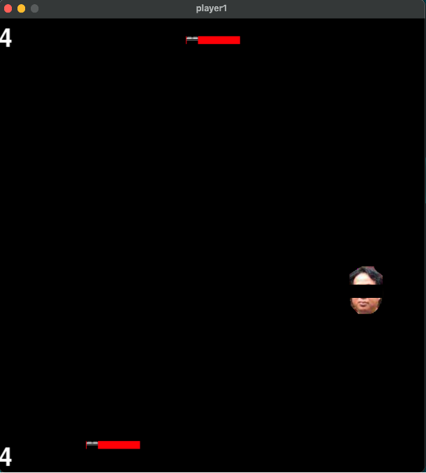
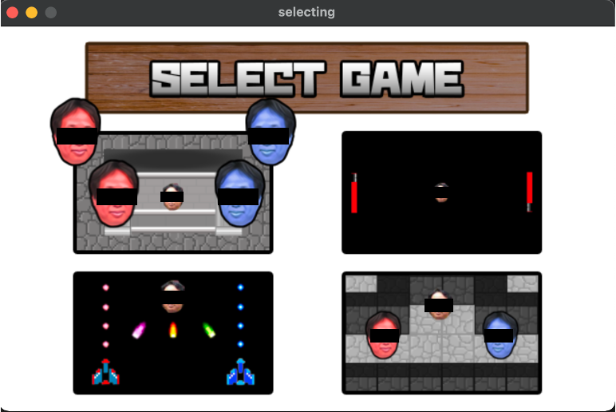

# IWAIGAMES

このファイルはネットワークプログラミング演習という授業の最終課題で作成したファイルです。

## 1. IWAIGAMESとは?
IWAIGAMESは、UDP通信を利用した1対1のミニゲーム集(4種類)です。教授の顔を使ったゲームということでIWAIという名前がついています。

## 2. ゲーム紹介

### 1. IWAI VS IWAI

IWAI VS IWAI は対戦型シューティングゲームで、それぞれが赤IWAI、青IWAIを操作することができます。

上下左右キーで動くことができ、スペースキーを押すことで発射する弾を相手に当てることで勝利となります。

### 2. IWAI RACE

IWAI RACE は対戦型レースゲームで、それぞれが赤IWAI、青IWAIを操作することができます。

上下左右キーで動くことができ、真ん中のIWAIに触れることで勝利となります。

### 3. IWAI SHOOTING

IWAI SHOOTING は協力型シューティングゲームで、それぞれが赤い戦闘機、青い戦闘機を操作することができます。

左右キーで動くことができ、上キーを押すことで発射する弾をIWAIに当て、IWAIの体力が0になることでクリアとなります。

### 4. IWAI HOCKEY

IWAI HOCKEY は対戦型ホッケーゲームで、それぞれがバーを操作することができます。

左右キーで動くことができ、先に5点を取ることで勝利となります。

## 3. 遊び方

はじめに、IWAIGAMES内のmain.pyを起動することでタイトル画面が表示されます。

タイトル画面をクリックすると、他のプレイヤーを待つための待機画面へと遷移します。

プレイヤーが揃うとゲーム選択画面へ遷移します。

上下左右キーでゲームを選び、エンターキーでゲームを選択することができ、ゲームが終了した場合はこの画面に戻ってきます。

